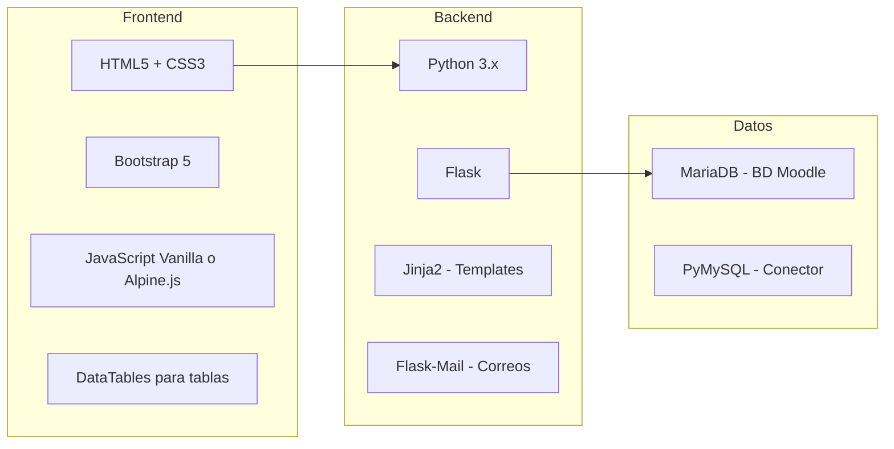
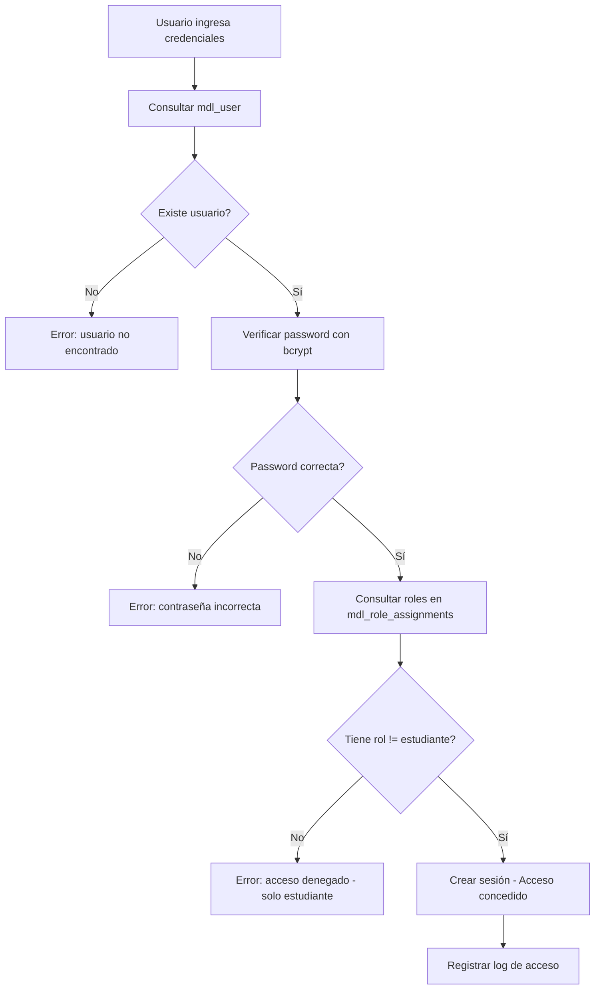
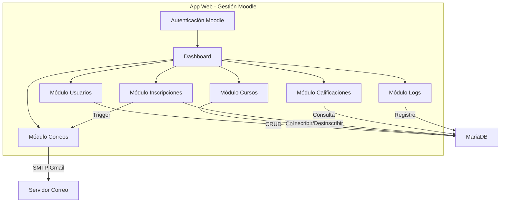
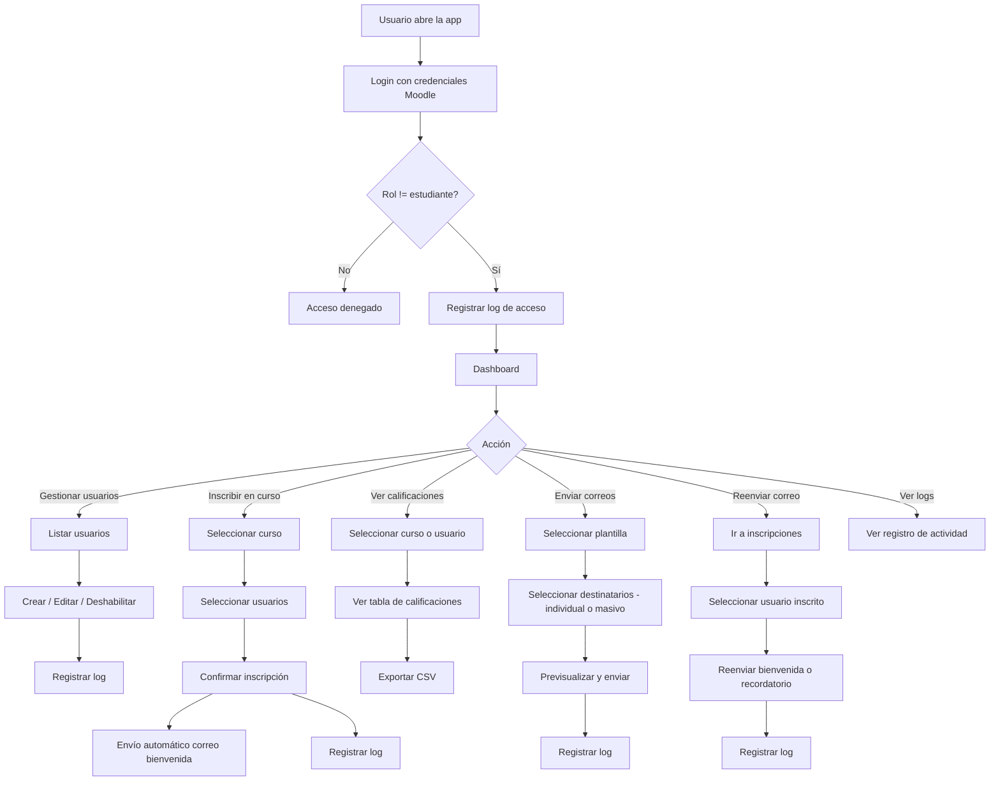

# Plan para Desarrollo de App de Gestión Moodle

## 1. Contexto del Proyecto

| Aspecto | Detalle |
|---------|---------|
| **Plataforma LMS** | Moodle (versión por confirmar) |
| **Base de datos** | MariaDB, nombre: `moodle`, prefijo: `mdl_` |
| **Servidor Moodle** | 192.168.1.212 (red local) |
| **URL Moodle** | `http://190.71.122.76/moodle` (según config.php) |
| **SMTP** | Gmail via `smtp.gmail.com:587` con TLS |
| **Equipos cliente** | Windows 7, 10 y 11 en red local |
| **Conocimientos del equipo** | JavaScript, Python, algo de PHP |

### Funcionalidades Requeridas
1. **Autenticación con Moodle**: login con credenciales de Moodle, solo roles diferentes a estudiante pueden acceder
2. **Gestión de usuarios**: crear, editar, deshabilitar
3. **Inscripción a cursos**: inscribir/desinscribir usuarios en cursos
4. **Consulta de calificaciones**: ver notas por usuario y por curso
5. **Envío de correos**: plantillas predeterminadas de bienvenida y recordatorio
6. **Envío masivo de correos**: seleccionar múltiples destinatarios o grupos completos
7. **Reenvío de correos**: opción de reenviar bienvenida o recordatorio para acceder al curso
8. **Correo automático**: envío automático de bienvenida al inscribir en un curso
9. **Registro de logs**: todas las acciones quedan registradas con usuario, fecha y detalle

---

## 2. Análisis de Arquitectura: Web vs Escritorio

### Opción A: Aplicación Web (RECOMENDADA)

| Criterio | Evaluación |
|----------|------------|
| Compatibilidad W7/W10/W11 | Solo necesita navegador web |
| Instalación | Cero instalación en clientes |
| Mantenimiento | Centralizado en el servidor |
| Actualizaciones | Inmediatas, sin redistribuir |
| Acceso multiusuario | Nativo |
| Dependencia de red | Sí, pero es red local |

### Opción B: Aplicación de Escritorio

| Criterio | Evaluación |
|----------|------------|
| Compatibilidad W7/W10/W11 | Problemática en W7 con Python moderno |
| Instalación | Requiere instalar en cada equipo |
| Mantenimiento | Distribuido, más complejo |
| Actualizaciones | Hay que redistribuir ejecutable |
| Acceso multiusuario | Cada instancia es independiente |
| Dependencia de red | Solo para BD |

### Opción C: Aplicación Híbrida con Electron

| Criterio | Evaluación |
|----------|------------|
| Compatibilidad W7/W10/W11 | Buena pero pesada |
| Instalación | Requiere instalar |
| Mantenimiento | Complejo |
| Actualizaciones | Redistribuir |
| Ventaja | Interfaz web con acceso local |

### Decisión: **Opción A - Aplicación Web**
La app web es la mejor opción porque:
- No requiere instalación en los equipos cliente
- Se puede desplegar en el mismo servidor de Moodle o en otro de la red
- Compatible con cualquier Windows que tenga un navegador
- Actualizaciones centralizadas e inmediatas
- Python/Flask es ligero y suficiente para red local

---

## 3. Stack Tecnológico Seleccionado



### Justificación del Stack
- **Python/Flask**: Ligero, fácil de aprender, ideal para APIs y apps web pequeñas-medianas
- **Bootstrap 5**: Framework CSS maduro, responsive, compatible con navegadores antiguos
- **Alpine.js**: Alternativa ligera a Vue/React, ideal para interactividad sin complejidad de SPA
- **PyMySQL**: Conector nativo Python para MariaDB/MySQL
- **Flask-Mail**: Integración SMTP sencilla para envío de correos
- **Jinja2**: Motor de plantillas incluido en Flask, sirve tanto para HTML como para plantillas de correo
- **bcrypt**: Para verificar contraseñas de Moodle en la autenticación

---

## 4. Integración con Moodle

### Estrategia: Conexión Directa a BD + SMTP propio

**¿Por qué NO usar la API REST de Moodle?**
- La API REST requiere configuración adicional en Moodle (tokens, servicios web habilitados)
- No sabemos si está habilitada en esta instalación
- Para operaciones internas en red local, la conexión directa a BD es más rápida y flexible
- Tenemos las credenciales de BD disponibles en el config.php

**Tablas principales de Moodle a utilizar:**

| Tabla | Uso |
|-------|-----|
| `mdl_user` | Gestión de usuarios y autenticación |
| `mdl_course` | Listado de cursos |
| `mdl_enrol` | Métodos de inscripción |
| `mdl_user_enrolments` | Inscripciones de usuarios |
| `mdl_grade_items` | Ítems de calificación |
| `mdl_grade_grades` | Calificaciones de usuarios |
| `mdl_role_assignments` | Asignación de roles (usado para autenticación y permisos) |
| `mdl_role` | Definición de roles (manager, teacher, editingteacher, etc.) |
| `mdl_context` | Contextos de Moodle |

### Consideraciones Importantes
- **Hashing de contraseñas**: Moodle usa `bcrypt` para contraseñas. Al crear usuarios desde la app, se debe usar el mismo algoritmo
- **Campos obligatorios**: Al crear usuarios, Moodle requiere campos como `username`, `password`, `firstname`, `lastname`, `email`, `auth`, `confirmed`, `mnethostid`
- **Inscripciones**: Se debe crear el registro en `mdl_user_enrolments` y también la asignación de rol en `mdl_role_assignments` con el contexto correcto
- **Calificaciones**: Las notas están en `mdl_grade_grades` vinculadas a `mdl_grade_items` por curso

---

## 5. Autenticación y Control de Acceso

### Flujo de Autenticación
La app usará las **mismas credenciales de Moodle** para el login. El proceso es:

1. El usuario ingresa su `username` y `password` de Moodle
2. La app consulta `mdl_user` para obtener el hash bcrypt de la contraseña
3. Se verifica la contraseña con `bcrypt.checkpw()`
4. Se consulta `mdl_role_assignments` + `mdl_role` para obtener los roles del usuario
5. **Solo se permite acceso si el usuario tiene un rol diferente a "student"** (roleid != 5)
6. Roles permitidos: manager, coursecreator, editingteacher, teacher, non-editing teacher



### Permisos por Rol
| Rol Moodle | Acceso a la App | Permisos |
|------------|----------------|----------|
| manager | Sí | Acceso total |
| coursecreator | Sí | Acceso total |
| editingteacher | Sí | Gestión de sus cursos |
| teacher | Sí | Consulta y correos de sus cursos |
| student | **NO** | Acceso denegado |

---

## 6. Sistema de Logs y Auditoría

Todas las acciones realizadas en la app quedarán registradas en una tabla propia de la aplicación.

### Tabla de Logs: `app_action_log`
| Campo | Tipo | Descripción |
|-------|------|-------------|
| `id` | INT AUTO_INCREMENT | Identificador único |
| `user_id` | INT | ID del usuario que realizó la acción |
| `username` | VARCHAR | Username del usuario |
| `action` | VARCHAR | Tipo de acción (LOGIN, CREATE_USER, EDIT_USER, ENROL_USER, SEND_EMAIL, BULK_EMAIL, etc.) |
| `target_type` | VARCHAR | Tipo de entidad afectada (user, course, enrolment, email) |
| `target_id` | INT | ID de la entidad afectada |
| `details` | TEXT | Descripción detallada de la acción en JSON |
| `ip_address` | VARCHAR | IP del cliente |
| `created_at` | DATETIME | Fecha y hora de la acción |

### Acciones Registradas
- Login/logout de usuarios
- Creación, edición y deshabilitación de usuarios
- Inscripción y desinscripción de cursos
- Envío de correos individuales
- Envío masivo de correos
- Reenvío de correos
- Consulta de calificaciones
- Exportación de datos

### Vista de Logs
- Tabla paginada con filtros por: usuario, acción, fecha, entidad
- Exportable a CSV
- Accesible solo para rol manager

---

## 7. Diseño de Módulos de la Aplicación



### 7.1 Dashboard
- Resumen de usuarios activos/inactivos
- Cursos con más inscripciones
- Últimas acciones realizadas (desde logs)
- Accesos rápidos a funciones principales

### 7.2 Módulo de Usuarios
- **Listar**: Tabla paginada con búsqueda y filtros (activo/inactivo, por nombre, email)
- **Crear**: Formulario con campos requeridos por Moodle
- **Editar**: Modificar datos del usuario (nombre, email, etc.)
- **Deshabilitar**: Cambiar campo `suspended` a 1 (no eliminar)
- **Ver detalle**: Cursos inscritos, calificaciones, último acceso

### 7.3 Módulo de Cursos
- **Listar cursos**: Tabla con nombre, categoría, cantidad de inscritos
- **Ver participantes**: Lista de usuarios inscritos en un curso
- **Detalle del curso**: Información general y estadísticas

### 7.4 Módulo de Inscripciones
- **Inscribir usuario**: Seleccionar usuario y curso, asignar rol (estudiante por defecto)
- **Inscripción masiva**: Subir CSV con lista de usuarios a inscribir
- **Desinscribir**: Remover inscripción de un usuario en un curso
- **Trigger automático**: Al inscribir, enviar correo de bienvenida

### 7.5 Módulo de Calificaciones
- **Por usuario**: Ver todas las calificaciones de un usuario en todos sus cursos
- **Por curso**: Ver calificaciones de todos los participantes de un curso
- **Exportar**: Descargar calificaciones en formato CSV/Excel
- **Filtros**: Por rango de fechas, por estado de aprobación

### 7.6 Módulo de Correos
- **Plantillas predeterminadas**:
  - Bienvenida al inscribir en curso
  - Recordatorio para acceder al curso
  - Notificación de calificaciones
  - Personalizable con variables: `{nombre}`, `{curso}`, `{url_curso}`, `{fecha}`
- **Envío manual individual**: Seleccionar un usuario y plantilla, enviar
- **Envío masivo**: Seleccionar múltiples usuarios, un curso completo, o filtrar por criterios y enviar correo con plantilla a todos
- **Reenvío**: Botón para reenviar bienvenida o recordatorio desde la vista de inscripciones
- **Envío automático**: Al inscribir usuario en curso, se envía bienvenida automáticamente
- **Historial**: Registro de correos enviados (individual y masivo)
- **Cola de envío**: Para envíos masivos, respetar el límite de 10 correos por lote con pausa entre lotes

### 7.7 Módulo de Logs
- **Vista de actividad**: Tabla paginada con todas las acciones realizadas
- **Filtros**: Por usuario, tipo de acción, rango de fechas, entidad afectada
- **Exportar**: Descargar logs en CSV
- **Acceso**: Solo usuarios con rol manager

---

## 8. Estructura del Proyecto

```
moodle-admin-app/
├── app/
│   ├── __init__.py          # Inicialización Flask
│   ├── config.py            # Configuración BD, SMTP, etc.
│   ├── models/
│   │   ├── user.py          # Modelo de usuarios
│   │   ├── course.py        # Modelo de cursos
│   │   ├── enrolment.py     # Modelo de inscripciones
│   │   ├── grade.py         # Modelo de calificaciones
│   │   └── log.py           # Modelo de logs
│   ├── routes/
│   │   ├── auth.py          # Rutas de autenticación (login/logout)
│   │   ├── dashboard.py     # Rutas del dashboard
│   │   ├── users.py         # Rutas de usuarios
│   │   ├── courses.py       # Rutas de cursos
│   │   ├── enrolments.py    # Rutas de inscripciones
│   │   ├── grades.py        # Rutas de calificaciones
│   │   ├── emails.py        # Rutas de correos
│   │   └── logs.py          # Rutas de logs
│   ├── services/
│   │   ├── db.py            # Conexión a MariaDB
│   │   ├── auth.py          # Servicio de autenticación con Moodle
│   │   ├── mail.py          # Servicio de correos
│   │   ├── logger.py        # Servicio de registro de logs
│   │   └── moodle.py        # Lógica específica de Moodle
│   ├── decorators/
│   │   └── auth.py          # Decoradores de autenticación y roles
│   ├── templates/
│   │   ├── base.html        # Layout principal
│   │   ├── login.html       # Página de login
│   │   ├── dashboard.html
│   │   ├── users/
│   │   ├── courses/
│   │   ├── enrolments/
│   │   ├── grades/
│   │   ├── logs/
│   │   └── emails/
│   │       ├── welcome.html
│   │       └── reminder.html
│   └── static/
│       ├── css/
│       ├── js/
│       └── img/
├── requirements.txt
├── run.py                   # Punto de entrada
└── README.md
```

---

## 9. Flujo de Trabajo Principal



---

## 10. Configuración SMTP (ya disponible)

Según el config.php de Moodle:
- **Host**: `smtp.gmail.com:587`
- **Seguridad**: TLS
- **Usuario**: `clinicaestudia@clinicadelapresentacion.com.co`
- **Contraseña de app**: Disponible en config
- **Máximo por lote**: 10 correos

La app reutilizará esta misma configuración SMTP.

---

## 11. Plan de Implementación

### Fase 1: Infraestructura Base y Autenticación
- [ ] Configurar proyecto Python/Flask
- [ ] Establecer conexión a MariaDB
- [ ] Crear layout base con Bootstrap y página de login
- [ ] Implementar autenticación con credenciales de Moodle (bcrypt)
- [ ] Validar rol del usuario (denegar acceso a estudiantes)
- [ ] Crear tabla `app_action_log` para registro de logs
- [ ] Implementar servicio de logging para todas las acciones

### Fase 2: Gestión de Usuarios
- [ ] Listar usuarios con paginación y búsqueda
- [ ] Crear nuevos usuarios (con hash bcrypt)
- [ ] Editar datos de usuarios existentes
- [ ] Deshabilitar/habilitar usuarios

### Fase 3: Gestión de Cursos e Inscripciones
- [ ] Listar cursos disponibles
- [ ] Ver participantes de un curso
- [ ] Inscribir usuarios en cursos
- [ ] Desinscribir usuarios de cursos
- [ ] Inscripción masiva por CSV

### Fase 4: Calificaciones
- [ ] Consultar calificaciones por usuario
- [ ] Consultar calificaciones por curso
- [ ] Exportar calificaciones a CSV

### Fase 5: Sistema de Correos
- [ ] Configurar Flask-Mail con SMTP de Gmail
- [ ] Crear plantillas de correo (bienvenida, recordatorio)
- [ ] Envío manual individual de correos con plantilla
- [ ] Envío masivo de correos (selección múltiple, por curso, por filtro)
- [ ] Cola de envío masivo respetando límite de 10 por lote
- [ ] Envío automático al inscribir en curso
- [ ] Reenvío de bienvenida/recordatorio desde inscripciones
- [ ] Historial de correos enviados

### Fase 6: Dashboard, Logs y Pulido
- [ ] Dashboard con estadísticas
- [ ] Vista de logs con filtros y exportación
- [ ] Pruebas en Windows 7, 10 y 11
- [ ] Documentación de uso

---

## 12. Despliegue

La app se puede desplegar de dos formas:

1. **En el mismo servidor de Moodle** (192.168.1.212): Ejecutar Flask en un puerto diferente (ej: 5000). Acceso: `http://192.168.1.212:5000`
2. **En un servidor separado**: Instalar Python y la app en otro equipo de la red local

Para producción se recomienda usar **Gunicorn** (Linux) o **Waitress** (Windows) como servidor WSGI en lugar del servidor de desarrollo de Flask.
